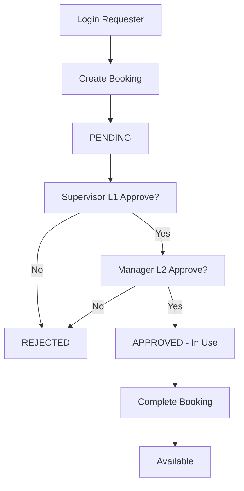

# Activity Diagram - Vehicle Booking Feature

```
[Start] 
    ↓
[Login as Requester] 
    ↓
[Create Booking]
    ├── Select Vehicle (available)
    ├── Select Driver  
    ├── Select L1 Supervisor
    ├── Select L2 Manager
    ├── Fill dates/purpose
    └── Submit
    ↓
[PENDING status]
    ↓
[Supervisor (L1) - Approvals Page]
    ├── [APPROVE] → approved_level_1 + ApprovalHistory
    └── [REJECT] → rejected + reason + History
    ↓
[Manager (L2) - IF Approved L1]
    ├── [APPROVE] → APPROVED + vehicle=in_use + History
    └── [REJECT] → rejected + reason + History
    ↓
[Booking APPROVED]
    ├── Driver sees assignment
    ├── Fuel log possible
    └── Vehicle status = in_use
    ↓
[Booking COMPLETED]
    ├── End Odometer/Fuel
    └── Vehicle = available
    ↓
[End]
```

## Key Activities

1. **Multi-Level Approval**: L1→L2 chain
2. **Vehicle Status**: available → in_use → available  
3. **Audit Trail**: ApplicationLog + ApprovalHistory
4. **Fuel Tracking**: Per booking
5. **Reports**: Excel export with filters

**Visual (Mermaid syntax for draw.io):**




